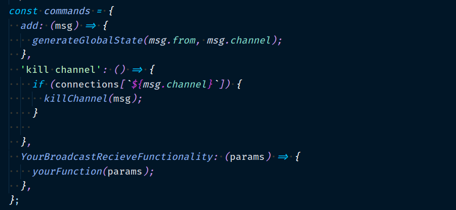

<h1>SUMARY</h1>
<h2>
  ENG:
</h2>
<h3></h3>

<h3>
  This server will scale as much as you need. It detects the number of cpus in your cluster and make the best out of what you have. It send messages between the processes with IPC Unix protocol so every process knows the global state of the application. When receiving a message it resend it to all processes that are logged in the subject that the connection sender is on. When receiving a message from other process it share it with all the websocket connections of that subject.
</h3>

<h2>
 PT:
</h2>

<h3>
   Este servidor irá escalar conforme houver necessidade. Ele detecta o número de cpus no seu cluster e se adapta da melhor forma possivel. Ele manda mensagens entre os processos criados com uma comunicação IPC unix para que cada processo saiba o estado global da aplicação. Quando receber uma mensagem, ele irá reenviar esta para todos os processos logados no canal em que a conexão de envio está. Quando receber uma mensagem de outro processo, ele ira enviar para suas conexões websocket do respectivo canal.
</h3>

<h1>HOW IT WORKS</h1>
<h2>
  ENG:
</h2>

<h3>
 Once a conenction is made, the cluster sends a message to the master process, which will update all clusters at the server with the new global state of the application. Each cluster has it`s own application`s global state object and will update it when a message from master is recieved as shown bellow.
</h3>

<h2>
  PT:
</h2>

<h3>
Uma vez feita uma conexão com um cluster , este enviará uma mensagem para o cluster master , o qual irá informar os demais do novo estado global da aplicação. Cada cluster tem seu próprio objeto representando o estado global da aplicação e o atualizará uma vez que receber uma mensagem do cluster master como mostrado abaixo.
</h3>

<h2>
  ENG:
</h2>

<h3>
1) A new Connection is made with cluster 3.
</h3>

<h3>
2) Cluster 3 send this information to master.
</h3>

<h3>
3) Master resend it to all clusters.
</h3>

<h2>
  PT:
</h2>

<h3>
1) Uma nova conexão é feita com o cluster 3.
</h3>

<h3>
2) Cluster 3 manda essa informação para o master.
</h3>

<h3>
3) Master reenvia informação para todos os clusters.
</h3>

<h1>CONNECT TO A CHANNEL</h1>
<h2>
  ENG:
</h2>

<h3>
To connect to a channel you must connect to the websocket ip and add the channel afterwards.
</h3>

<h3>
Example: ws://ipFromServer:port/yourChannelName
</h3>

<h2>
 PT:
</h2>

<h3>
Para conectar a um canal do servidor, você precisa acessar o ip do websocket e colocar o nome do seu canal após a barra.
</h3>

<h3>
Exemplo: ws://ipDoServidor:porta/nomeDoCanal
</h3>
<h1>KILL A CHANNEL</h1>
<h2>
  ENG:
</h2>

<h3>
To kill a channel you must send an http delete like http://ipFromYourServer/delete/:channel.
</h3>

<h2>
 PT:
</h2>

<h3>
Para apagar um canal do servidor, você precisa mandar um http delete para http://seuIpDoServidor/delete/:chanal .
</h3>

<h1>KILL CONNECTION</h1>
<h2>
  ENG:
</h2>

<h3>
To kill a connection you must send an http delete like http://ipFromYourServer/kill-connection/:channel/:connectionId/:workerID . Connection id and worker id where sent through websocket when the connection was stablished. When the data from server is deleted it will send a message to the connection saying the status of the connection is disconnected. Use this to cancel the connection from your cient side. 
</h3>

<h2>
 PT:
</h2>

<h3>
Para apagar uma conexão do servidor, você precisa mandar um http delete para http://seuIpDoServidor/kill-connection/:chanal/:connectionId/:workerID . Connection id e worker id foram enviados via websocket quando a conexão foi estabelecida. Quando os dados de conexão forem excluidos do servidor, ele enviará uma mensagem pela conexão websocket dizendo que o estado da conexão é disconnected. Use isto para matar a conexão no lado do cliente.
</h3>

<h1>MESSAGES</h1>
<h2>
  ENG:
</h2>

<h3>
All messages recieved and sent by the server are JSONs by default, so its easier to deal with them at the server side. When receiving a message from a connection, the cluster checks for all the other clusters that have the same connection`s channel and then resend the message directly to those clusters. When the message is recieved they post it to all websocket connections that have that same channel as the image bellow shows.
</h3>

<h2>
 PT:
</h2>

<h3>
Todas as mensagens recebidas e enviadas pelo servidor estão em formato JSON para que fique mais facil a comunicação. Quando um cluster recebe uma mensagem por uma conexão, ele procura por todos os demais clusters que possuem uma conexão com o mesmo canal e reenvia diretamente essa mensagem para cada um. Uma vez que a mensagem é recebida, o cluster que a recebeu a enviará para todas as suas conexões websocket que possuirem esse canal como mostra a imagem abaixo.
</h3>

<h2>
  ENG:
</h2>

<h3>
1) Message recieved from webscoket connection at cluster 4.
</h3>

<h3>
2) Cluster 4 checks in its global aplication object for all clusters with the same channel.
</h3>

<h3>
3) cluster 4 send the message to all clusters found with that channel.
</h3>

<h3>
4) After recieving a message the cluster resend it through the websocket connection with that channel.

</h3>
<h2>
  PT:
</h2>

<h3>
1) Mensagem recebida no cluster 4.
</h3>

<h3>
2) Cluster 4 verifica por outros cluster com conexões ligadas ao mesmo canal.
</h3>

<h3>
3) Cluster 4 envia a mensagem para todos os demais encontrados com o mesmo canal.
</h3>

<h3>
4) Após receber a mensagem o cluster reenvia ela para suas conexões websocket conectadas ao canal.
</h3>

<h1>
CUSTOMISE
</h1>
<h2>
  ENG:
</h2>

<h3>
Here is where all the aplication`s public messages are recieved and delt with. If you want to add a functionality, just add it on the "commands" object and then add the command key on the message.
</h3>

<h2>
 PT:
</h2>

<h3>
 Aqui é onde todas as mensagens publicas da aplicação são recebidas e trabalhadas. Se quiser adicionar uma funcionabilidade, adicione ela no objeto commands e então adicione também uma chave command no objeto da mensagem.
</h3>

<h2>
  ENG:
</h2>

<h3>
Here are all the one to many message functionalities between the intern processes are declared. If you want to add one just put it on the commands broadCastCommands bellow.
</h3>

<h2>
 PT:
</h2>

<h3>
Aqui é onde todas as funcionabilidades internas de mensagens um para muitos são declaradas. Se quiser adicionar mais uma funcionabilidade, coloque sua função dentro do objeto broadCastCommands como as demais abaixo.
</h3>

 <h2>
  ENG:
</h2>

<h3>
 Here is where all the functions our server provides are declared. You provide a key named "type" in the message sent so the object can find the corresponding function. That way we don`t have to create an additional condition every new function we add.
</h3>
<h2>
WARNING!!!
</h2>
<h3>
Don`t use "command","add","close" or "kill channel" as a "type" key! It is already an intern key used on this aplication
</h3>

<h2>
 PT:
</h2>

<h3>
Aqui é onde se adiciona todas as funcionabilidades do servidor. Se fornece uma chave que será enviada junto com a mensagem pelo cliente e essa chave dará acesso á função correspondente. Desta forma, conseguimos com que não precise criar uma condicional nova para cada funcionabilidade acrescentada.
</h3>
<h2>
ATENÇÃO!!!
</h2>
<h3>
Não use "command","add","close" ou "kill channel" como valor da chave "type"! Elas ja estão sendo usadas em processos internos da aplicação.
</h3>

<h1>
LAST CONSIDERATIONS
</h1>
<h2>
  ENG:
</h2>

<h3>
 There is a console log that shows when new connections are made or lost. It can affect directly in the server`s performance as the ammout of concurrent connections grow. Therefore you can delete or comment it for better results if needed.
 You can boost your node max ram usage to improove performance as well.
</h3>

<h2>
 PT:
</h2>

<h3>
Existe um console log que mostra quando uma conexão é feita ou desfeita. Isso pode afetar diretamente a perfomance do servidor conforme a quantidade de conexões simultaneas cresce. Portanto pode-se comentar ou deletar esse console log para melhores resultados se necessario.
Para melhor performance pode-se boostar o uso maximo de ram por node também.
</h3>

by:Felipe Gené de Faria
